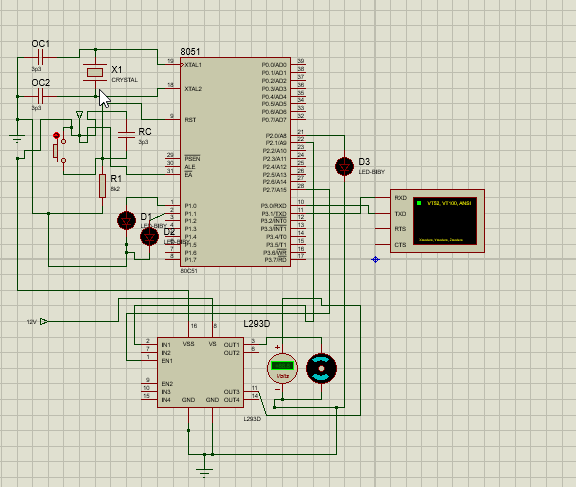

## Home Appliance control using Bluetooth  
This is my Third year project of home appliance control using bluetooth along with it's Proteus simulation. 
Components Used:  
- 8051 microcontroller
- crystal oscillator
- capacitors
- resistors
- bluetooth module HC-05
- LED
- L293D motor driver IC
- DC motor 

Serial communication between HC05 bluetooth module with AT89C51 to control light emitting diodes and direct current motor.  
Designed and developed on a single layered printed circuit board.  
The microcontroller is programmed using C language.  

*There is a finalBTSchematic which is the circuit for our PCB, the simulation has the changes needed to be maded to recieve data serially*

