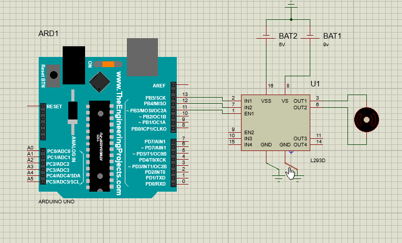

## Motor with variable speed using arduino UNO  
In this project you will get the code for controlling a motor who's speed can be changed and also It's direction of rotation can be changed.  
Also I have added my Proteus Simulation for the project.  
You can run this simulation by uploading the hex file of arduino code on the simulation.  

