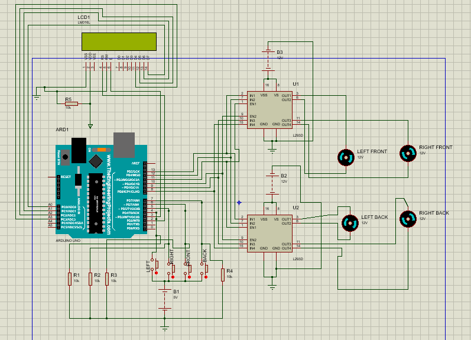

## Robot With LCD interfaced  
This project is a simulation of wheels of a robot/ car.  
You can make it turn left, right, front and back while **you hold their respective buttons.**  
- For movement in left direction, left wheels should stop moving and the right wheels should rotate clockwise.  
- For movement in right direction, right wheels should stop moving and the left wheels should rotate anti-clockwise.  
- For movement in front, the right wheels should rotate clockwise and left wheels should rotate anti-clockwise.  
- For movement in back, the left wheels should rotate clockwise and right wheels should rotate anti-clockwise.  
Also the movement of the robot will be displayed on the LCD.

